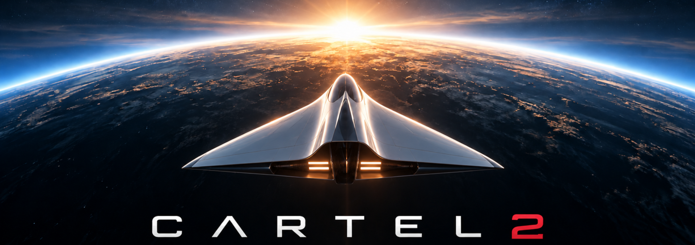

# Cartel 2



**Cartel** is a 2D near-orbit spaceship game for [Godot 4.7+](https://godotengine.org/) (GL Compatibility). Fly with inertia, dock at habitats, trade commodities, outfit ships at the yard, and jump between sectors through Unspace gates.

**Status:** early development — in-game version **DEV**. Gameplay and content are incomplete; see [Project status](#project-status) below.

## Features

- Newtonian flight, boost, sensors, and orbital navigation
- Habitat hubs: terminal, exchange, shipyard, and building interactions
- Modular ship assembly with catalog-driven parts and engineering budgets
- Commodity trading at habitat Exchanges
- Passenger and freight charter missions
- Save/load to three slots under `user://saves/`

## Requirements

- Godot **4.7.2** or newer (4.7 feature tag, GL Compatibility renderer)
- **Python 3** — optional; used by art/catalog tooling under `scripts/tools/`

Set `GODOT` to your Godot binary if it is not on `PATH`. The CI script defaults to `$HOME/opt/Godot_v4.7.2-stable_linux.x86_64` when `GODOT` is unset.

## Quick start

```bash
git clone <repository-url>
cd cartel2
```

**Editor:** open `project.godot` in Godot and press **F5**.

**CLI:**

```bash
GODOT=/path/to/Godot --path . --editor   # or omit --editor and press F5 in the GUI
```

On **New Game**, choose callsign, portrait, and starting background. The default **Tester** kit begins docked at **Proxima Habitat** with the template fleet.


## Repository layout

| Path | Purpose |
|------|---------|
| `scripts/gameplay/` | Rules and session state (`RefCounted`; no scene tree) |
| `scripts/presentation/` | World loading, ship motion, Godot integration |
| `scripts/ui/` | Menus, HUD, habitat and shipyard screens |
| `data/catalog/` | JSON content (ships, commodities, economies, worlds) |
| `assets/` | Art, fonts, logos |
| `docs/` | Architecture, data model, and setting bible |
| `tests/` | Headless unit tests (custom `TestRunner`, not GUT) |
| `scenes/dev/` | Sandboxes for theme, combat, stealth, and rendering |

Layering and conventions: [docs/design/architecture.md](docs/design/architecture.md) and [AGENTS.md](AGENTS.md).

## Development

After changing GDScript or files under `data/catalog/`, run the full verification gate:

```bash
GODOT=/path/to/Godot ./scripts/ci/check.sh
```

The script validates catalogs, imports assets, parses scripts, and runs unit tests. Use `./scripts/ci/check.sh --fast` for a quicker loop (validators + tests only).

**Useful commands** (from repo root, with `GODOT` set):

```bash
# Reimport assets after adding art
$GODOT --path . --headless --import --quit

# Regenerate placeholder location art
python3 scripts/tools/generate_placeholder_art.py

# Rebuild UI theme after token changes
$GODOT --headless --path . --script res://scripts/tools/build_cartel_theme.gd
```

**Dev sandboxes** — open a scene under `scenes/dev/` in the editor and press **F6**, or run one directly, for example:

```bash
$GODOT --path . --scene res://scenes/dev/theme_showcase.tscn
```

Other sandboxes: `ship_assembly_sandbox`, `combat_sandbox`, `stealth_sandbox`, `system_render_tester`.

Player portraits: drop PNG, WebP, or JPG files into `assets/ui/portraits/` as `p1.png`, `p2.png`, … and reimport.

## Documentation

- [docs/README.md](docs/README.md) — index
- **Design** — [architecture](docs/design/architecture.md), [data model](docs/design/data_model.md), [UI theme](docs/design/ui_theme.md)
- **Setting** — [overview](docs/setting/overview.md) and [setting index](docs/setting/README.md)

Setting docs are the lore target; catalogs implement the current playable subset.

## License

Cartel is licensed under the [GNU Affero General Public License v3.0](LICENSE).

IBM Plex Sans and IBM Plex Mono in `assets/ui/fonts/` are under the [SIL Open Font License 1.1](assets/ui/fonts/LICENSE.txt).

