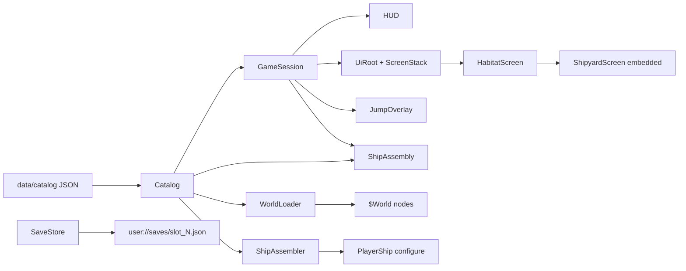
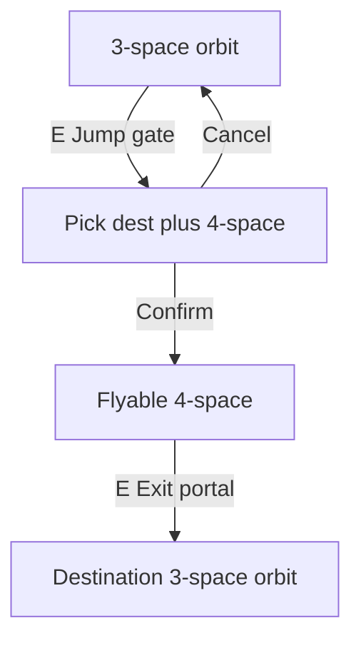

# Architecture

High-level structure of the Godot 4.7 near-orbit game. Historical design notes from the original Java/XML design repo are reference only.

## Design principles

1. **Gameplay logic without nodes** — rules, state, and catalog loading live in `scripts/gameplay/` as `RefCounted` types. No scene tree dependency.
2. **Presentation adapts data** — `scripts/presentation/` wires Godot nodes to gameplay objects (`CharacterBody2D`, world scenes, camera).
3. **UI is thin** — `scripts/ui/` binds `CanvasLayer` overlays to session and catalog; it emits signals rather than mutating game state directly.
4. **Data-driven content** — orbit layouts, interactables, ships, habitats, and jump routes come from JSON under `data/catalog/`.

## Directory layout

| Path | Role |
|------|------|
| `scripts/gameplay/` | `Catalog`, generated catalog records (`AmmunitionDef`, `ChassisDef`, `CommodityDef`, `EconomyDef`, `ModuleDef`, `ShipDef`, `SectorDef`, plus shared `CatalogSignature` / `CatalogDamagePackets` / `CatalogNeighborhood`), `GameSession`, `PlayerState`, `WorldPresence`, `Fleet`, `Wallet`, `CombatPersistence`, `EventBus`, `SimEvent`, `GameVersion`, `SaveStore`, `GalacticCalendar`, `Simulation`, `SimClock`, `SimSubsystem`, `EconomySubsystem`, `MissionSubsystem`, `GameClock`, `CommodityEconomy`, `ShipAssembler`, `ShipAssembly`, `ShipSimCore`, `ShipOperations`, `ShipWeapons`, `ShipCombat`, `ShipCombatState`, `ShipMotion`, `ShipStats`, `OwnedShip`, `AssembledShip`, `ShipOperatingState`, `SensorSystem`, `FieldConditions`, `WeaponHit`, `DebrisHealth`, `TransponderBroadcast`, `CombatPilot`, `TrafficDirector`, `TrafficActor`, `TrafficSpawn`, `TrafficDetection`, `TrafficRouting`, `InteractableDef` |
| `scripts/presentation/` | `main.gd`, `FlightLoopController`, `WorldController`, `MenuController`, `player_ship.gd`, `npc_ship.gd`, `EngineExhaust`, `ShipVisual`, `TrafficView`, `PresentationNodePool`, `world_loader.gd`, `world_object.gd`, `interactable.gd`, camera, starfield |
| `scripts/ui/` | HUD, main menu, save overlay, pause overlay, jump overlay, `UiRoot`, `ScreenStack`, habitat/shipyard screens |
| `scenes/ui/` | Full-screen habitat UI, shipyard assembly, reusable components |
| `data/catalog/` | JSON catalogs; machine-readable schema subset under `data/catalog/schema/` (field tables: [catalog_schema.md](catalog_schema.md); narrative: [data_model.md](data_model.md)) |
| `scripts/tools/` | Catalog validators including `validate_sector_completeness.py` and `generate_sector_bundle.py` for multi-file sector authoring |
| `assets/` | Art referenced by catalog paths |
| `themes/` | `cartel_theme.tres` — corporate UI theme (see [ui_theme.md](ui_theme.md)) |

## Data flow

`GameSession` is an aggregate root: `PlayerState`, `WorldPresence`, `Fleet`, `Wallet`, and `CombatPersistence` own the fields; public properties on `GameSession` forward to those slices so UI and tests keep using `session.credits` and `session.owned_ships`. Save JSON keys are unchanged — `to_dict` / `from_save` compose the slice serializers.

On startup, `main.gd` wires three presentation controllers and delegates to them:

1. Loads `Catalog.load_default()` — ammunition, chassis, modules (from `data/catalog/modules/*.json`), ships, and sectors materialise as generated `*Def` records at load. The assembly pipeline stores `ModuleDef` on `AssembledShip`; yard/catalog listing still exposes `Dictionary` via `get_module()` / `list_modules()`. Chassis/ships/sectors dictionary getters remain for a later pass.
2. **MenuController** shows the **main menu** (New Game / Load / Exit).
3. **New Game** — player enters callsign, portrait, and background; `GameSession.start_new_game` seeds fleet from `backgrounds.json`, docks at the kit's habitat, and opens **HabitatScreen** at the Terminal.
4. **Load** — reads a JSON slot from `user://saves/` and restores session, fleet, cargo, spare parts, and flight state.
5. **WorldController** assembles the current ship via `ShipAssembler.assemble_owned` and calls `WorldLoader.load_sector` or `load_unspace` to populate `$World`.
6. **FlightLoopController** ticks traffic and feeds nav/signature HUD each physics frame when flight is active.
7. Controllers bind HUD and overlays to session state; `main.gd` keeps `session` and `try_interact` on the node, and injects `session` into `PlayerShip` / `FollowCamera` via `configure` / `bind_session`.

## Habitat UI (menu planet)

Docking opens **UiRoot** — a full-screen opaque Control UI (not a dim overlay). Navigation uses **ScreenStack** (`push_screen`, `pop_screen`, `replace_screen`):

- **HabitatScreen** — location shell (future orbitals/malls reuse the same pattern): habitat header (name, description, pilot, credits, GST); two-column body with a narrow **building list** and a right column. Each building shows a **building header** (name + long description left, banner art right) and a non-scrollable **`ContentPane`** below it. Building types resolve through **BuildingPanelRegistry** (`embed` / `placeholder`). **TerminalPanel**, **MarketPanel**, **DealerPanel**, and embedded **ShipyardScreen** mount full-rect in `ContentPane` (`configure_embedded(true)` on the yard hides duplicate header/back). List+detail building UIs scroll **vertically only** inside the detail column, never at the location pane. Unknown types (e.g. `bar`) show a placeholder label in `ContentPane`. Building `short_desc` is tooltips only — transactional messages use the log footer.
- **TerminalPanel** — three columns: docked ship list, scrollable **ShipDetailPanel** (modules/stats/signature), admin column (rename, `ShipAssembly.undock_blockers`, Launch).
- **ShipDetailPanel** — shared owned-ship readout (art, optional summary, modules and/or engineering/flight blocks, signature via `ModuleSpecText`). **TerminalPanel** and **ShipyardScreen** configure section flags; the yard slot board stays shipyard-only.
- **UI patterns** — production habitat panels use `scenes/ui/patterns/` (`status_row`, `headline_item`, `metric_block`) via [`UiPatterns`](scripts/ui/ui_patterns.gd). Yard stock row subtitles use `ModuleSpecText.format_stock_list_meta`. `compact_toolbar`, `data_table`, and `alert_banner` remain showcase references for now.
- **MarketPanel** — exchange listings plus scrollable commodity detail; buy/sell via `GameSession`.
- **DealerPanel** — used-ship or chassis stock from building `stock`; scrollable detail with buy.
- **ShipyardScreen** — embedded yard body: docked ships, slot board with drag-and-drop fitting, tabbed yard stock by module category, buy/sell/refuel. Propulsion stock sorts by price, type, or thrust; row meta shows `engine_type` and thrust. Power stock sorts by price, type, or MW; row meta shows `plant_type` and output. Computer stock sorts by price, type, or CU; row meta shows `core_type` and capacity. Life support stock sorts by price or crew; row meta shows crew, Transport vs Habitat, and luxury flags. Hover any yard part or occupied slot for full module specs via `ModuleSpecText.format_tooltip()`. Propulsion modules carry `brand` and `engine_type` (`chemical` | `hydro_thermal` | `electric_plasma` | `direct_fusion` | `antimatter` | `gravitic` | `integrated_sail`); power modules carry `brand` and `plant_type` (`fission` | `fusion` | `radioisotope`); computer modules carry `brand` and `core_type` (`silicon` | `photon` | `quantum`); life support modules carry `brand` and optional `ls_habitat` / `ls_comfort` / `ls_luxury` capability flags in `modules.json`. `ls_habitat` marks live-aboard cabin volume; its absence is transport seating. LSS `volume` includes that cabin.

Reusable DnD components live under `scenes/ui/components/` (`module_slot`, `module_stock_item`).

UI scripts receive a **UiContext** (`catalog`, `session`, `stack`, callbacks). They never load JSON or run gameplay rules directly — they call `GameSession` / `ShipAssembly` and refresh on `session.changed`.

**GameScreen** (`scripts/ui/game_screen.gd`) is the shared base for docked location UI: `bind(context)` stores **UiContext**, connects `session.changed` (deferred) to `refresh()`, and provides default `handle_back()` (pop **ScreenStack** when depth > 1). **HabitatScreen**, **TerminalPanel**, **MarketPanel**, **DealerPanel**, and **ShipyardScreen** extend it. CanvasLayer overlays (menu, pause, HUD, jump) stay plain `Control` / `CanvasLayer` nodes.

- **New building panel** — scene root extends **GameScreen**; override `refresh()`; optional `configure(building)` for building-specific state; register the scene in **BuildingPanelRegistry** `_EMBED_SCENES`. Habitat embeds the panel in `ContentPane` and calls `bind(context)` plus `configure` when the building is selected.
- **New stack screen** (rare) — same base; override `handle_back()` only if the default pop is wrong; push via **UiRoot** / habitat and call `bind(context)`.

Location and building art paths live in catalog JSON under `assets/ui/locations/` (placeholder SVGs today).

### Ship assembly sandbox

For fitting and engineering work without the full game loop, run `scenes/dev/ship_assembly_sandbox.tscn` (CLI `--scene` or editor **F6**). It bootstraps `Catalog`, a sandbox `GameSession` (`session.sandbox = true`), and embeds `ShipyardScreen` with buy/sell disabled and unlimited module drag from catalog. Toolbar actions add empty hulls, strip modules, and restore manufacturer templates. Fitting validation (mounts, mass, volume) matches the main game.

### Combat sandbox

For 1v1 combat iteration without the full game loop, run `scenes/dev/combat_sandbox.tscn` (CLI `--scene` or editor **F6**). Combat and stealth sandboxes extend **`FlightSandboxBase`** for catalog/session bootstrap, setup overlay, player/HUD/camera chrome, and Esc-to-setup; bout vs drill spawn, tick, and detection logic stay in each subclass. The setup overlay lists all manufacturer templates from `ships.json` with read-only stats and installed systems. **Begin bout** places player and opponent on the starfield just beyond combined weapon range, facing each other with zero velocity. Opponent attitude is **Fight to the death** (default, stays engaged) or **Standard NPC** (provoked fight-or-flight from `TrafficActor`). **Esc** ends the bout and returns to setup. Uses production `PlayerShip`, `NpcShip`, `ShipCombat`, and HUD; no world landmarks or traffic director.

### Stealth sandbox

For signature and detection iteration without Proxima traffic, run `scenes/dev/stealth_sandbox.tscn` (CLI `--scene` or editor **F6**). **Begin drill** spawns the player at the origin with transponders off and 1–12 copies of the chosen target hull scattered near the rim of the player’s **`sensor_range`** (minimap matches that envelope). NPC sprites and radar blips stay hidden until channel threshold detection (`player_detected`). NPCs remain peaceful until sandbox acquire logic sees the player via signature channels or visual range, then they **ENGAGE** or **FLEE** per attitude. **Esc** returns to setup. Does not change production traffic’s combat-only reciprocal sensing cull.

## Main scene structure

`scenes/main.tscn`:

- **Starfield** — parallax background bound to follow camera.
- **World** — empty at edit time; populated at runtime by `WorldLoader`.
- **PlayerShip** — inertial flight, interaction sensor, camera.
- **HUD** — capability-gated flight chrome: top-left instrument cluster (`basic_hud`: speed, fuel, GST clock), top-right **Fields** (`local_sensor`), bottom-left **signature** (thermal / gravitational / EM / computational totals, transponder, active sensors), bottom-right local radar and viewport-edge waypoint arrows (`local_sensor` / waypoints), transponder label overlay (`sensor_read_beacons`). Hidden when docked.
- **MainMenu** — New Game, Load, Exit.
- **NewGameOverlay** — callsign, portrait picker, and background kit form.
- **SaveOverlay** — three-slot save/load browser.
- **PauseOverlay** — Resume, Save, Load, Quit to Menu (Escape during flight).
- **UiRoot** — opaque full-screen habitat UI with ScreenStack.
- **JumpOverlay** — Unspace route list at jump gates.

## Player loops

### Orbital flight

- `ShipSimCore` orchestrates the shared flight rules (shields, ops, signature glow, mass/stats, weapons, motion). The player calls every step each physics frame for HUD telemetry; slotted NPC traffic uses the same steps with interval stats refresh; unslotted NPCs skip ops/weapons/stats and only run cheap motion + glow.
- `ShipMotion` integrates thrust, rotation, boost, and damping from `ShipStats` (derived from assembled modules and loaded mass), modulated by operating-state `thrust_factor` and optional **environment scale** (`FieldConditions.thrust_scale_for_ship`: gravitic × local gravity, integrated sail × radiant/particle/magnetic mix, otherwise 1.0).
- `FieldConditions.sample(catalog, world, position)` reads sector `neighborhood` and world layout radii in 3-space, or a fixed unspace profile when `WorldPresence.in_unspace`. Setting: [field_conditions.md](../setting/field_conditions.md).
- Hold **Space** or **LMB** (`fire`) to discharge installed weapons along ship facing. `ShipWeapons` handles rate-of-fire cooldowns and ammo; `ShipOperations` allocates weapon power only while firing.
- `play_bounds` per sector defines the distant dust ring (visual landmark only; player flight is unbounded).
- `Interactable` areas on world objects; player `InteractSensor` picks nearest valid target.
- Flight HUD elements require installed module capabilities (`basic_hud`, `local_sensor`, `local_system_waypoints`, `sensor_read_beacons`, `4_space_topology` for unspace exit labelling). In-system ships require a powered `vessel_registration_beacon` (Commercial Article 19).

### Interaction kinds

| Kind | Behaviour |
|------|-----------|
| `inspect` | Log flavour text; track `inspected_ids` |
| `salvage` | One-time credits; id tracked in `salvaged_ids`; host `WorldObject` visual modulated (not a dedicated wreck scene) |
| `dock` | Pause tree, hide HUD, open UiRoot habitat screen, park current ship at habitat |
| `translate` | Pause tree, open jump overlay with sector `mappings` (pick destination + N-space depth) |
| `arrive` | At 4-space exit portal: complete transit into destination 3-space orbit |

Dock and jump-route selection set `get_tree().paused = true` until the overlay closes. **4-space transit itself is unpaused** — same inertial flight with hazards.

### Docking and shipyard

1. `[E]` at habitat → `session.dock(catalog, habitat_id)` → **HabitatScreen**.
2. Visit buildings from catalog list; **Proxima Exchange** for commodity buy/sell (per-ship cargo holds); **Shipyard** shows assembly inline in the habitat content pane.
3. Chassis is **fixed** per ship; modules install from **spare_parts** inventory by dragging stock onto compatible slots (or click spare then click slot). Buy at yard fills spares; drag off a slot to uninstall. Engineering panel shows mass, volume, power, compute, heat, fuel budgets.
4. Undock: **Terminal** → select docked ship → **Undock** → resume flight.

Ships parked at a habitat **stay there when jumping sectors** (only the aboard ship travels).

### Galactic Standard Time (GST)

Session state stores `gst_seconds` (see [setting/date_time.md](../setting/date_time.md)). `GalacticCalendar` formats timestamps. `Simulation.step` in `main.gd` advances time each frame (GST freeze from **MenuController** when paused, in menus, or docked in habitat UI) and dispatches registered subsystems (economy reposts market quotes on day rollover). `GameClock` remains a thin facade over `Simulation` for tests and legacy callers.

Successful gameplay mutations publish typed events on `GameSession.events` (`EventBus` + `SimEvent` factories — e.g. `commodity_traded`, `sector_entered`, `docked`). **MenuController** forwards those events to `Simulation.dispatch_event(session, catalog, evt)`, which calls `SimSubsystem.on_event(session, catalog, evt)`. UI still refreshes on the coarse `session.changed` signal; typed events are for simulation subsystems and future mission/faction hooks, not HUD wiring.

`MissionSubsystem` remains a development-only spike (not a content system): its hardcoded
Proxima→Bela delivery is registered explicitly by tests, never by production `Simulation`,
and is not auto-accepted on new game. A future mission vertical slice will replace it with
catalog-backed content and a production subsystem registration.

| Context | GST behaviour |
|---------|---------------|
| Realspace flight | 1:1 with real time |
| Habitat / building UI | 1:1 (tree may be paused; clock uses `PROCESS_MODE_ALWAYS`) |
| Unspace flight | Irregular pulses — stutter and jumps, more erratic at higher N |
| Jump gate entry / exit portal | Discrete lump from sector `mappings[]` (`entry_seconds`, `exit_seconds`, `time_jitter`) |
| Main menu, pause, save/load, jump picker | Frozen |

HUD and **HabitatScreen** header show `GstClockLabel` at seconds resolution. `session.changed` is **not** emitted every second — widgets poll `gst_seconds` directly.

### Jump travel (3-space ↔ 4-space ↔ 3-space)

1. `[E]` at jump gate (3-space only) → jump overlay lists destinations from `mappings[]`.
2. Select destination → confirm **4-space (n=4)** route. Known `solution` integer shown as flavour; no typing yet.
3. Confirm → `session.enter_unspace` → entry translation lump applied → `WorldLoader.load_unspace` → player at 4-space entry spawn, dim starfield behind undulating geometry.
4. Fly through 4-space: an **irregular Delaunay topographic mesh** (Poisson-scattered vertices, random per-vertex height) fills the play disk under the ship as a static ground plane in 3D. Player perturbations (edge kicks, ripples, radial bound) are disabled for now. GST advances irregularly while in transit.
5. `[E]` at **Exit Portal** (3D disc on a fixed host face; hidden 2D interactable for input; labelled only with `4_space_topology` sensors) → exit translation lump applied → `session.arrive_from_unspace` → load destination sector orbit.

Hyperdrive-equipped ships may later translate without a gate or from other 4-space regions — not implemented.

## World loading

3-space sectors (`proxima`, `bela`, and the nine additional worlds in `sectors.json`) use a structured layout in `worlds.json`:

- **`planet`** — lit 3D globe rendered in an isolated `SubViewport` and composited as a 2D disc at the origin (`PlanetBackdrop`, diameter 2000, `z_index -50`). Slow axial spin with a sun-lit day/night terminator; optional catalog `albedo` / `night_lights` wrap maps (legacy `sprite` is ignored for the globe mesh).
- **`orbital_ring`** — evenly spaced orbitals on a rotating ring (`OrbitalRing`); habitat is the largest and dockable; unnamed orbitals are visual-only
- **`jump_gate`** — static gate farther out (angle derived from sector id)
- **`entities`** (optional) — free-floating world objects spawned after the ring and gate (e.g. shootable **debris** rocks); not used for unspace worlds

4-space layouts are defined in `unspaces.json` as a **`field`** block: a one-shot Poisson-scattered point field, Delaunay triangulation (with optional convex quad merges), independent random vertex heights, and a fixed exit portal on a chosen host face. Flat `entities` lists in `worlds.json` are not used for unspace loading.

`WorldLoader.load_unspace` spawns an `NspaceField` instead of sector entity scenes. No dust ring in unspace. The field builds the mesh once from catalog tuning (`fov_vertex_count`, `scatter_margin`, `quad_merge_chance`, `height_scale`) so the play zone plus an FOV margin stays off-screen. **3D presentation** is rendered in an isolated `SubViewport` (`own_world_3d`) and composited behind the ship via `_draw()` on the field node. Heights map to the view axis (`Z`) as a ground plane under the 2D ship; an orthographic `Camera3D` tracks the active `Camera2D`. The exit portal is placed once on a host face from the route seed; its visual is a 3D disc in the backdrop while a hidden 2D `Area2D` handles `[E]` interaction. The unspace **visual** topo field applies no geometric forces on the player; ship flight uses the same `ShipMotion` path as 3-space orbit. **Environmental** field conditions still apply (very low fluctuating gravity, low radiant, fluctuating magnetic and particle indices) and scale gravitic thrust. **Ascidians** (1–3 per visit, visit-randomised spawn) wander in 2D logic but draw in 3D at mid height between min and max vertex Z; opaque terrain depth-tests against them so peaks occlude naturally. They appear as faint unlabeled radar contacts. Higher-N spaces may later project 3D geometry into the play plane; 4-space does not.

`WorldLoader` maps 3-space entity `kind` to packed scenes:

| Kind | Scene |
|------|-------|
| `habitat` | `scenes/world/habitat.tscn` |
| `jump_gate` | `scenes/world/jump_gate.tscn` |
| `orbital` | `scenes/world/orbital.tscn` (visual-only station) |
| `debris` | `scenes/world/debris_rock.tscn` (collision; weapon damage via `DebrisHealth`) |

Habitat and jump gate have interactable areas but **no solid collision** — the player flies over them. Orbital ring phase is persisted in `GameSession.orbital_phase_by_sector` (saved/loaded). `Simulation.step` advances phase for the current sector when in realspace flight; `OrbitalRing` reads phase for rotation (does not write session while docked or in unspace).

Each configured world object uses `WorldObject.configure(entity, catalog, session)` for position, label, sprite override, and interactable binding. 4-space uses `NspaceField.configure(unspace, catalog, session, play_bounds)`.

`WorldLoader.load_unspace` reads the `field` block from schema-validated `unspaces.json` (`UnspaceDef` at load; palette, scatter/Delaunay topo, portal placement, inhabitants). Mesh and portal policy knobs live in catalog data, not hard-coded depth formulas. `GameSession.unspace_solution` is set in `enter_unspace` from the selected route mapping and persisted across saves. Unspace GST irregularity is tuned per entry’s `gst` block (`SimClock` does not multiply by route `n`). Local radar in unspace scales to `play_bounds`. Exit portal nav contacts require the **`4_space_topology`** sensor capability.

The dust ring is a `Line2D` octagon generated from `play_bounds` at 3-space sector load time (not used in unspace). Local radar in 3-space scales to **content radius** (`max(jump_gate_radius, orbital_ring_radius) × 1.15`) so contacts stay readable when the dust ring is much larger than the playable landmarks.

## In-system NPC traffic (3-space)

`TrafficDirector` (gameplay) owns spawn policy, fleet size, sim slots, detection stagger, and actor AI when a sector loads. Each `TrafficActor` is a façade over `TrafficSpawn` (factory), `TrafficDetection` (stagger/contacts), and `TrafficRouting` (peaceful waypoints); tick, combat FSM, and `CombatPilot` wiring stay on the actor. `_sim_slot_pool` on the director is a **priority candidate list** for sim-slot assignment, not a node object pool. `TrafficView` (presentation) owns the `Traffic` node tree — pooled near `npc_ship.tscn` instances for slotted actors and pooled far sprite roots for the rest (release on near↔far LOD crossing instead of always `queue_free` + instantiate). Cached PackedScene for `npc_ship.tscn`. **FlightLoopController** ticks the director then syncs the view each physics frame. Presentation LOD follows `actor.near_lod` (= `has_sim_slot`); catalog `near_lod_radius` is unused in code. Sector landmark nav contacts come from a shared in-place cache on `WorldLoader` (callers compose a new array before appending traffic). Not active in Unspace or while docked.

- **Density** — log-scaled from `population_billions` on the sector (`traffic.json` caps; Proxima ~100 ships at population max, smaller worlds less).
- **Spawn** — on sector arrival, trip roles appear 15–85% along their corridor toward destination; loiter/runabout scatter near the jump gate and orbitals. Cycle replacements still launch from origin waypoints.
- **Variation** — per-ship cruise jitter; trip routes steer directly to destination with optional lateral offset at arrival spawn.
- **Simulation LOD** — up to `sim_slot_max` (~20) nearest ships run full `ShipSimCore` steps (`ShipOperations`, weapons, interval stats) and `NpcShip` physics. The rest of the fleet (~100 cap) are kinematic sprites with cheap cruise AI and motion-only sim.
- **Presentation LOD** — follows sim slots: slotted ships use `NpcShip` (`CharacterBody2D`); unslotted ships are distant sprites (not distance-based).
- **Roles** — transit, shuttle, dock_cycle share one-shot waypoint trips; loiter circles near the jump gate; runabout wanders between named anchors (habitat, gate, orbitals) and random free points inside the traffic envelope, repicking on arrival and optionally despawning at anchor stops (50% coin flip).
- **Lifecycle** — trip roles despawn on arrival at habitat, gate, or orbital interactable radius; runabouts may despawn at anchor stops or pick a new waypoint; director immediately spawns a fresh ship at a newly chosen origin (not the previous destination). FLEE ends after a timeout or when the player is far away (returns to TRAFFIC), or cycles out on reaching the flee anchor (habitat/gate); fleeing ships use peaceful velocity blending so they turn tightly instead of settling into orbit.
- **Combat** — provoked only; NPCs engage or flee at full engine cruise. ENGAGE sim-slotted NPCs use an instance `CombatPilot` (`scripts/gameplay/combat_pilot.gd`) fed a kinematic snapshot (position, velocity, facing, thrusting, weapon profile, max speed). Three range bands: **approach** (`> 2× weapon range`) closes at full speed when the target recedes or half speed when both close; **setup** (`weapon range` to `2× range`) flies a ±45° pass at ~55% speed; **dogfight** (`≤ weapon range`) energy-turns on intercept aim, coasts while lining up a shot, and fires whenever a feasible shot exists. When range opens toward `R`, a **maneuver interrupt** pauses fire and burns to cancel sideways relative velocity before closing; orbiting at constant range is treated the same way with **orbit latch hysteresis** so brief radial taps do not drop MANEUVER. Combat steering holds full `rotation_speed` until heading error is tiny. Per-bout standoff and closing-style jitter on `reset()`. **Pilot skill** (`NOVICE` / `EXPERIENCED` / `ELITE`, rolled on `reset()`) sets velocity EMA smoothing, fire graze radius, orbit-exit thresholds, and whether a thrusting target's **facing feint** is believed for intercept/receding/orbit (sticky for the burn). Intercept uses smoothed `target_vel` from `motion.velocity`, not `CharacterBody2D.velocity`. Ballistic, plasma, and rocket rounds inherit shooter velocity at spawn; intercept aim matches that model. Player/NPC hull collision is the **convex hull of chassis SVG primitives** via `HullHitbox` (not texture bounds); scene capsules remain fallback until configure/bind. Fire is independent of band; bore-sight on the aim point unless `CombatPilot.GUIDED_OFFBORE_FIRE` is enabled (future homing). `ShipCombat` resolves typed damage packets (PD → shields → armour → Hits/Power/Compute). Player and NPC shots apply combat damage; at 0 Hits thrust and weapons cut off. Docking repairs hull and integrity.
- **Sensors** — Branded sensor SKUs carry product-level `sensor_range`, `sensor_sensitivity`, optional `sensor_sensitivity_passive`, and `has_active` (no `detectors[]` in JSON). `SensorSystem` caches max range and per-channel sensitivity (active vs quiet profiles) at assemble time; in flight the player toggles **Active sensors** (`R`, `OwnedShip.active_sensors_enabled`) to choose full vs quiet sensitivity and whether active packages add ping **`signature{}`**. **Live signature** gates other contributions by operating state (thrust, fire, transponder, power load, compute use) with short propulsion/weapon afterglow. Detection and the flight HUD read live values; shipyard shows fitted totals. **`sensor_range`** is the hard envelope; inside it, contacts appear via **visual** (`visual_contact_radius`, 250 m default), **transponder override** (broadcasting + `local_sensor`), or **channel threshold** (`signature × sensitivity × range_weight ≥ threshold`, easier close / harder at rim). Undetected NPCs are hidden (no sprite, no radar blip). Landmarks/orbitals stay on the nav-contact path. Beacon text overlay only for detected, broadcasting ships with `sensor_read_beacons`. NPC traffic treats active sensors as on. NPC combat steering uses live player position only when the NPC has a reciprocal contact. Map rim aligns with content radius, not the dust ring.
- **Cruise** — peaceful traffic capped at `cruise_speed_fraction` (default 33%) of each hull's assembled `max_speed`; engage/flee uses full engine rating.
- **Bounds** — NPC recycle envelope is `gate_radius × 1.25`; player flight has no position clamp.

Catalog: `data/catalog/traffic.json`. Presentation: `TrafficView`, `scenes/npc_ship.tscn`, `scripts/presentation/npc_ship.gd`. Near-ship hull setup, damage tint, muzzle offset, and weapon-order spawning for player and slotted NPCs go through **`ShipVisual`** (`ChassisSprite` / `HullHitbox` underneath); **`EngineExhaust`** draws procedural thrust by fitted `engine_type` on the player, near NPCs, and far traffic (hidden `ThrustFlame` keeps stern alignment). Far-LOD traffic sprites stay in `TrafficView`.

## Graphics convention

| Format | Use |
|--------|-----|
| **SVG** | Ships, stations, gates, debris, orbitals |
| **PNG** | Starfield tiles, planet disc, painterly backgrounds |

Chassis entries reference hull **sprites**; SVG paint is the source of color (hull sprites render at `Color.WHITE`). The optional `hull_color` field is identity metadata (e.g. future radar/livery), not a sprite tint. World entities may override `sprite` and `modulate` in JSON. Workshop chassis swaps update both stats and hull appearance immediately.

**Production dimensions:** [sprite_sizes.md](sprite_sizes.md) — author-at canvas sizes so 1 SVG pixel = 1 world unit (no import-scale compensation).

Regenerate placeholders: `python3 scripts/tools/generate_placeholder_art.py` (runs Godot import for new SVG/PNG sidecars). Do not run on authored hull SVGs without guarding files — see sprite size catalog. If import is skipped, run `godot --path . --import --headless --quit` manually.

UI styling uses the shared **Cartel corporate theme** — see [docs/design/ui_theme.md](docs/design/ui_theme.md). Reference viewport: **1920×1080**.

## Save / load

- Three fixed slots: `user://saves/slot_1.json` … `slot_3.json` (directory configurable via `SaveStore.save_dir` for tests).
- Saves store pilot identity, full `GameSession` state (including `spare_parts`), owned ship instances (modules, per-ship cargo, fuel, ammunition), player flight position/velocity/facing, and `game_version` (from `GameVersion.VERSION`).
- Optional top-level `subsystems` envelope: `Simulation.collect_save()` writes one versioned section per registered `SimSubsystem` (`{version, data}` keyed by subsystem `id`). `Simulation.apply_save()` restores each section (running `migrate` when the stored version is older). Missing envelope on v1/v2 saves is valid — subsystems reset to defaults. Session/UI fields are unchanged; market quotes remain derived on load.
- Catalog JSON under `data/catalog/` remains read-only; saves never write there.
- Save/load available from the pause menu (in flight) and from HabitatScreen footer (while docked).

## Not yet implemented

- On-foot play: city roadmaps, trams, surface travel
- Named NPCs, dialogue trees, Dialogue Manager integration
- Unspace solution typing (integers shown as flavour only)
- Deeper N-space routes (n > 4)
- Ship hyperdrive translation
- Homing missiles, scatter pellet cones, combat game-over screen
- Paid workshop beyond parts inventory model
- Hull merchants beyond Proxima Habitat (Concord Scouts, Skyedge)
- Economic events (blockades, route friction overrides beyond `route_friction_delta` UI)
- Unknown/private Unspace routes
- Market contract depletion (depth is display-only)

Deferred design passes (propulsion fuel types, gravitic hyper-travel range): [backlog.md](backlog.md).

See `data/catalog/` and [setting docs](../setting/README.md) for implemented subset vs intended scope.
