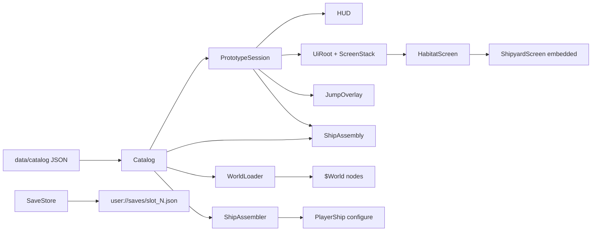
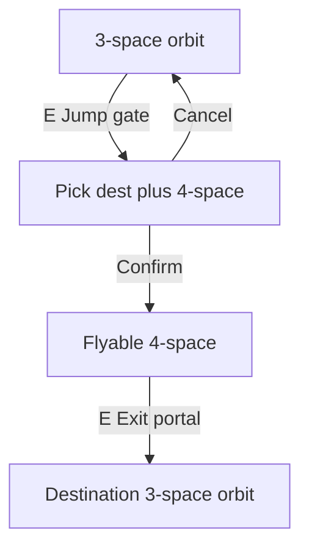

# Architecture

High-level structure of the Godot 4.7 near-orbit prototype. This document describes **this repository**, not the original Java/XML POC.

## Design principles

1. **Gameplay logic without nodes** — rules, state, and catalog loading live in `scripts/gameplay/` as `RefCounted` types. No scene tree dependency.
2. **Presentation adapts data** — `scripts/presentation/` wires Godot nodes to gameplay objects (`CharacterBody2D`, world scenes, camera).
3. **UI is thin** — `scripts/ui/` binds `CanvasLayer` overlays to session and catalog; it emits signals rather than mutating game state directly.
4. **Data-driven content** — orbit layouts, interactables, ships, habitats, and jump routes come from JSON under `data/catalog/`.

## Directory layout

| Path | Role |
|------|------|
| `scripts/gameplay/` | `Catalog`, `PrototypeSession`, `SaveStore`, `GalacticCalendar`, `GameClock`, `ShipAssembler`, `ShipAssembly`, `ShipOperations`, `ShipWeapons`, `ShipMotion`, `OwnedShip`, `AssembledShip`, `ShipOperatingState`, `WeaponHit`, `InteractableDef` |
| `scripts/presentation/` | `main.gd`, `player_ship.gd`, `world_loader.gd`, `world_object.gd`, `interactable.gd`, camera, starfield |
| `scripts/ui/` | HUD, main menu, save overlay, pause overlay, jump overlay, `UiRoot`, `ScreenStack`, habitat/shipyard screens |
| `scenes/ui/` | Full-screen habitat UI, shipyard assembly, reusable components |
| `data/catalog/` | JSON catalogs (see [data_model.md](data_model.md)) |
| `assets/` | Art referenced by catalog paths |
| `themes/` | `cartel_theme.tres` — corporate UI theme (see [ui_theme.md](ui_theme.md)) |

## Data flow

On startup, `main.gd`:

1. Loads `Catalog.load_default()`.
2. Shows the **main menu** (New Game / Load / Exit).
3. **New Game** — player enters name and callsign; `PrototypeSession.start_new_game` seeds fleet from `player.json`, parks all ships at Proxima Habitat, and opens **HabitatScreen** docked at the Terminal.
4. **Load** — reads a JSON slot from `user://saves/` and restores session, fleet, cargo, spare parts, and flight state.
5. Assembles the current ship via `ShipAssembler.assemble_owned`.
6. Calls `WorldLoader.load_sector` or `load_unspace` to populate `$World`.
7. Binds HUD and overlays to session state.

## Habitat UI (menu planet)

Docking opens **UiRoot** — a full-screen opaque Control UI (not a dim overlay). Navigation uses **ScreenStack** (`push_screen`, `pop_screen`, `replace_screen`):

- **HabitatScreen** — building list from catalog, location art frame, type-based content panels (terminal, Exchange market, embedded Shipyard assembly).
- **ShipyardScreen** — embedded in the habitat content pane when Shipyard is selected: docked ships, slot board with drag-and-drop fitting, tabbed yard stock by module category, buy/sell/refuel.

Reusable DnD components live under `scenes/ui/components/` (`module_slot`, `module_stock_item`).

UI scripts receive a **UiContext** (`catalog`, `session`, `stack`, callbacks). They never load JSON or run gameplay rules directly — they call `PrototypeSession` / `ShipAssembly` and refresh on `session.changed`.

Location and building art paths live in catalog JSON under `assets/ui/locations/` (placeholder SVGs today).

### Ship assembly sandbox

For fitting and engineering work without the full game loop, run `scenes/dev/ship_assembly_sandbox.tscn` (CLI `--scene` or editor **F6**). It bootstraps `Catalog`, a sandbox `PrototypeSession` (`session.sandbox = true`), and embeds `ShipyardScreen` with buy/sell disabled and unlimited module drag from catalog. Toolbar actions add empty hulls, strip modules, and restore manufacturer templates. Fitting validation (mounts, mass, volume) matches the main game.

## Main scene structure

`scenes/main.tscn`:

- **Starfield** — parallax background bound to follow camera.
- **World** — empty at edit time; populated at runtime by `WorldLoader`.
- **PlayerShip** — inertial flight, interaction sensor, camera.
- **HUD** — capability-gated flight chrome: basic instrument cluster (computer), local radar and waypoint arrows (sensor). Hidden when docked.
- **MainMenu** — New Game, Load, Exit.
- **NewGameOverlay** — pilot name and callsign form.
- **SaveOverlay** — three-slot save/load browser.
- **PauseOverlay** — Resume, Save, Load, Quit to Menu (Escape during flight).
- **UiRoot** — opaque full-screen habitat UI with ScreenStack.
- **JumpOverlay** — Unspace route list at jump gates.

## Player loops

### Orbital flight

- `ShipMotion` integrates thrust, rotation, boost, and damping from `ShipStats` (derived from assembled modules and loaded mass), modulated by operating-state `thrust_factor`.
- Hold **Space** or **LMB** (`fire`) to discharge installed weapons along ship facing. `ShipWeapons` handles rate-of-fire cooldowns and ammo; `ShipOperations` allocates weapon power only while firing.
- `play_bounds` per sector defines the dust ring; the world still renders the boundary ring.
- `Interactable` areas on world objects; player `InteractSensor` picks nearest valid target.
- Flight HUD elements require installed module capabilities (`basic_hud`, `local_sensor`, `local_system_waypoints`).

### Interaction kinds

| Kind | Behaviour |
|------|-----------|
| `inspect` | Log flavour text; track `inspected_ids` |
| `salvage` | One-time credits; id tracked in `salvaged_ids`; wreck visual modulated |
| `dock` | Pause tree, hide HUD, open UiRoot habitat screen, park current ship at habitat |
| `translate` | Pause tree, open jump overlay with sector `mappings` (pick destination + N-space depth) |
| `arrive` | At 4-space exit portal: complete transit into destination 3-space orbit |

Dock and jump-route selection set `get_tree().paused = true` until the overlay closes. **4-space transit itself is unpaused** — same inertial flight with hazards.

### Docking and shipyard

1. `[E]` at habitat → `session.dock(catalog, habitat_id)` → **HabitatScreen**.
2. Visit buildings from catalog list; **Proxima Exchange** for commodity buy/sell (per-ship cargo holds); **Shipyard** shows assembly inline in the habitat content pane.
3. Chassis is **fixed** per ship; modules install from **spare_parts** inventory by dragging stock onto compatible slots (or click spare then click slot). Buy at yard fills spares; drag off a slot to uninstall. Engineering panel shows mass, volume, power, compute, heat, fuel budgets.
4. Undock: **Terminal** → select docked ship → **Undock** → resume flight.

Ships parked at a habitat **stay there when jumping sectors** (only the aboard ship travels).

### Galactic Standard Time (GST)

Session state stores `gst_seconds` (see [setting/date_time.md](../setting/date_time.md)). `GalacticCalendar` formats timestamps; `GameClock` in `main.gd` advances time each frame.

| Context | GST behaviour |
|---------|---------------|
| Realspace flight | 1:1 with real time |
| Habitat / building UI | 1:1 (tree may be paused; clock uses `PROCESS_MODE_ALWAYS`) |
| Unspace flight | Irregular pulses — stutter and jumps, more erratic at higher N |
| Jump gate entry / exit portal | Discrete lump from sector `mappings[]` (`entry_seconds`, `exit_seconds`, `time_jitter`) |
| Main menu, pause, save/load, jump picker | Frozen |

HUD and **HabitatScreen** header show `GstClockLabel` at seconds resolution. `session.changed` is **not** emitted every second — widgets poll `gst_seconds` directly.

### Jump travel (3-space ↔ 4-space ↔ 3-space)

1. `[E]` at jump gate (3-space only) → jump overlay lists destinations from `mappings[]`.
2. Select destination → confirm **4-space (n=4)** route. Known `solution` integer shown as flavour; no typing yet.
3. Confirm → `session.enter_unspace` → entry translation lump applied → `WorldLoader.load_unspace` → player at 4-space entry spawn, violet starfield tint.
4. Fly through 4-space: N-space **shear hazards** knock the ship and stress hull (non-lethal); solid debris uses existing collision. GST advances irregularly while in transit.
5. `[E]` at **Exit Portal** (`arrive` interactable) → exit translation lump applied → `session.arrive_from_unspace` → load destination sector orbit.

Hyperdrive-equipped ships may later translate without a gate or from other 4-space regions — not implemented.

## World loading

3-space sectors (`proxima`, `bela`) use a structured layout in `worlds.json`:

- **`planet`** — full-disc background sprite at the origin (non-interactable, no collision)
- **`orbital_ring`** — evenly spaced orbitals on a rotating ring (`OrbitalRing`); habitat is the largest and dockable; unnamed orbitals are visual-only
- **`jump_gate`** — static gate farther out (angle derived from sector id)

4-space layouts (`n4_default`) still use a flat **`entities`** list (beacons, debris, hazards, exit portal).

`WorldLoader` maps entity `kind` to packed scenes:

| Kind | Scene |
|------|-------|
| `habitat` | `scenes/world/habitat.tscn` |
| `jump_gate` | `scenes/world/jump_gate.tscn` |
| `orbital` | `scenes/world/orbital.tscn` (visual-only station) |
| `beacon` | `scenes/world/beacon.tscn` |
| `wreck` | `scenes/world/wreck.tscn` |
| `debris` | `scenes/world/debris_rock.tscn` |
| `hazard` | `scenes/world/hazard.tscn` (4-space shear fields) |
| `planet_limb` | Sprite2D spawned in code (legacy) |

Habitat and jump gate have interactable areas but **no solid collision** — the player flies over them. Orbital ring phase is persisted in `PrototypeSession.orbital_phase_by_sector` (saved/loaded).

Each configured world object uses `WorldObject.configure(entity, catalog, session)` for position, label, sprite override, and interactable binding. Hazards use `NspaceHazard.configure(entity)`.

`WorldLoader.load_unspace` loads layouts from `worlds.json` via `unspaces.json` (`world_id`), with a violet dust ring and no planet unless specified.

The dust ring is a `Line2D` octagon generated from `play_bounds` at load time (not stored in JSON).

## Graphics convention

| Format | Use |
|--------|-----|
| **SVG** | Ships, stations, gates, beacons, wrecks, debris, orbitals |
| **PNG** | Starfield tiles, planet disc, painterly backgrounds |

Chassis entries reference hull sprites and `hull_color` modulate. World entities may override `sprite` and `modulate` in JSON. Workshop chassis swaps update both stats and hull appearance immediately.

Regenerate placeholders: `python3 scripts/tools/generate_placeholder_art.py`, then Godot reimport.

UI styling uses the shared **Cartel corporate theme** — see [docs/design/ui_theme.md](docs/design/ui_theme.md). Reference viewport: **1920×1080**.

## Save / load

- Three fixed slots: `user://saves/slot_1.json` … `slot_3.json`.
- Saves store pilot identity, full `PrototypeSession` state (including `spare_parts`), owned ship instances (modules, per-ship cargo, fuel, ammunition), and player flight position/velocity/facing.
- Catalog JSON under `data/catalog/` remains read-only; saves never write there.
- Save/load available from the pause menu (in flight) and from HabitatScreen footer (while docked).

## Explicit non-goals (current prototype)

- On-foot play: city roadmaps, trams, surface travel
- Named NPCs, dialogue trees, Dialogue Manager integration
- Unspace solution typing (integers shown as flavour only)
- Deeper N-space routes (n > 4)
- Ship hyperdrive translation
- NPC ship combat, shield hit pools, full damage-type combat loop
- Paid workshop beyond parts inventory model
- NPC traffic
- Full six-sector world (only Proxima and Bela implemented in JSON)

See [data_model.md](data_model.md) for implemented catalog subset vs [setting docs](../setting/README.md) for intended scope.
