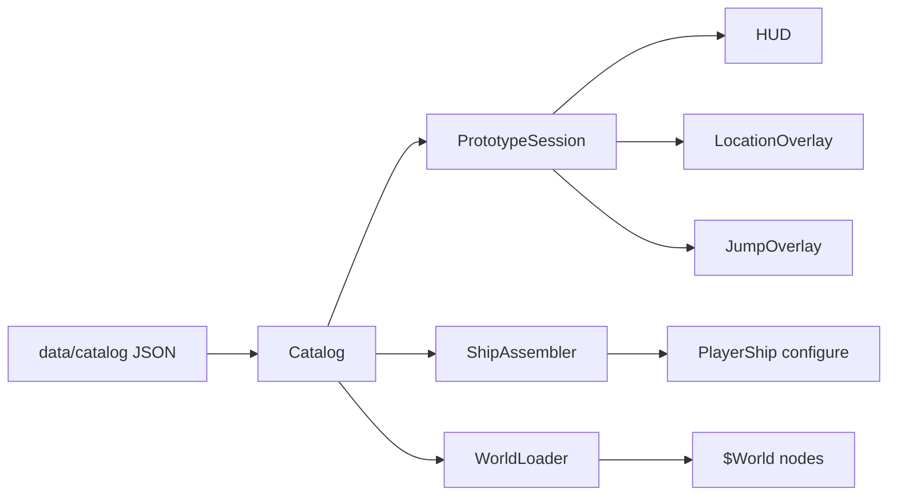
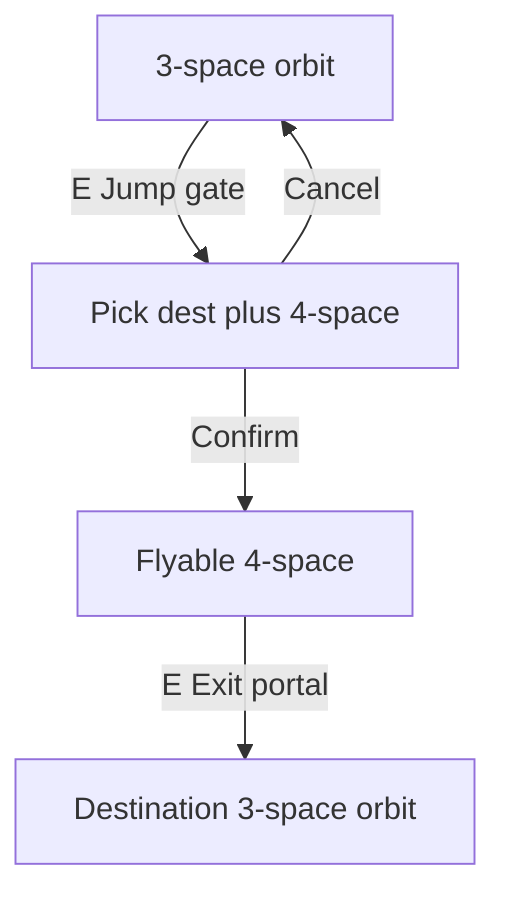

# Architecture

High-level structure of the Godot 4.7 near-orbit prototype. This document describes **this repository**, not the original Java/XML POC.

## Design principles

1. **Gameplay logic without nodes** — rules, state, and catalog loading live in `scripts/gameplay/` as `RefCounted` types. No scene tree dependency.
2. **Presentation adapts data** — `scripts/presentation/` wires Godot nodes to gameplay objects (`CharacterBody2D`, world scenes, camera).
3. **UI is thin** — `scripts/ui/` binds `CanvasLayer` overlays to session and catalog; it emits signals rather than mutating game state directly.
4. **Data-driven content** — orbit layouts, interactables, ships, habitats, and jump routes come from JSON under `data/catalog/`.

## Directory layout

| Path | Role |
|------|------|
| `scripts/gameplay/` | `Catalog`, `PrototypeSession`, `ShipAssembler`, `ShipMotion`, `OwnedShip`, `InteractableDef` |
| `scripts/presentation/` | `main.gd`, `player_ship.gd`, `world_loader.gd`, `world_object.gd`, `interactable.gd`, camera, starfield |
| `scripts/ui/` | HUD, pause overlay, location overlay (dock menu), jump overlay |
| `scenes/` | `main.tscn`, player ship, world object scenes, overlays |
| `data/catalog/` | JSON catalogs (see [data_model.md](data_model.md)) |
| `assets/` | Art referenced by catalog paths |

## Data flow

On startup, `main.gd`:

1. Loads `Catalog.load_default()` and `PrototypeSession.load_player(catalog)`.
2. Assembles the current ship via `ShipAssembler.assemble_owned`.
3. Calls `WorldLoader.load_sector` to populate `$World` from `worlds.json` for the player's `starting_sector`.
4. Binds HUD and overlays to session state.

## Main scene structure

`scenes/main.tscn`:

- **Starfield** — parallax background bound to follow camera.
- **World** — empty at edit time; populated at runtime by `WorldLoader`.
- **PlayerShip** — inertial flight, interaction sensor, camera.
- **HUD** — ship summary, location, objective, credits, target, motion.
- **PauseOverlay** — escape pause (disabled while docked).
- **LocationOverlay** — habitat dock menu (buildings, workshop, undock picker).
- **JumpOverlay** — Unspace route list at jump gates.

## Player loops

### Orbital flight

- `ShipMotion` integrates thrust, rotation, boost, and damping from `ShipStats` (derived from chassis + engine + armour).
- `play_bounds` per sector defines the dust ring; HUD warns when the player drifts outside.
- `Interactable` areas on world objects; player `InteractSensor` picks nearest valid target.

### Interaction kinds

| Kind | Behaviour |
|------|-----------|
| `inspect` | Log flavour text; track `inspected_ids` |
| `salvage` | One-time credits; id tracked in `salvaged_ids`; wreck visual modulated |
| `dock` | Pause tree, open location overlay, park current ship at habitat |
| `translate` | Pause tree, open jump overlay with sector `mappings` (pick destination + N-space depth) |
| `arrive` | At 4-space exit portal: complete transit into destination 3-space orbit |

Dock and jump-route selection set `get_tree().paused = true` until the overlay closes. **4-space transit itself is unpaused** — same inertial flight with hazards.

### Docking and workshop

1. `[E]` at habitat → `session.dock(catalog, habitat_id)`.
2. Location overlay shows buildings; workshop (`kind: "workshop"`) lists docked ships and module swap buttons from catalogs.
3. Undock: pick a parked ship at this habitat → `session.undock(catalog, ship_id)` → resume flight with chosen loadout.

Ships parked at a habitat **stay there when jumping sectors** (only the aboard ship travels).

### Jump travel (3-space ↔ 4-space ↔ 3-space)

1. `[E]` at jump gate (3-space only) → jump overlay lists destinations from `mappings[]`.
2. Select destination → confirm **4-space (n=4)** route. Known `solution` integer shown as flavour; no typing yet.
3. Confirm → `session.enter_unspace` → `WorldLoader.load_unspace` → player at 4-space entry spawn, violet starfield tint.
4. Fly through 4-space: N-space **shear hazards** knock the ship and stress hull (non-lethal); solid debris uses existing collision.
5. `[E]` at **Exit Portal** (`arrive` interactable) → `session.arrive_from_unspace` → load destination sector orbit.

Hyperdrive-equipped ships may later translate without a gate or from other 4-space regions — not implemented.

## World loading

`WorldLoader` maps entity `kind` to packed scenes:

| Kind | Scene |
|------|-------|
| `habitat` | `scenes/world/habitat.tscn` |
| `jump_gate` | `scenes/world/jump_gate.tscn` |
| `beacon` | `scenes/world/beacon.tscn` |
| `wreck` | `scenes/world/wreck.tscn` |
| `debris` | `scenes/world/debris_rock.tscn` |
| `hazard` | `scenes/world/hazard.tscn` (4-space shear fields) |
| `planet_limb` | Sprite2D spawned in code |

Each configured world object uses `WorldObject.configure(entity, catalog, session)` for position, label, sprite override, and interactable binding. Hazards use `NspaceHazard.configure(entity)`.

`WorldLoader.load_unspace` loads layouts from `worlds.json` via `unspaces.json` (`world_id`), with a violet dust ring and no planet limb unless specified.

The dust ring is a `Line2D` octagon generated from `play_bounds` at load time (not stored in JSON).

## Graphics convention

| Format | Use |
|--------|-----|
| **SVG** | Ships, stations, gates, beacons, wrecks, debris |
| **PNG** | Starfield tiles, planet limb, painterly backgrounds |

Chassis entries reference hull sprites and `hull_color` modulate. World entities may override `sprite` and `modulate` in JSON. Workshop chassis swaps update both stats and hull appearance immediately.

Regenerate placeholders: `python3 scripts/tools/generate_placeholder_art.py`, then Godot reimport.

## Explicit non-goals (current prototype)

- On-foot play: city roadmaps, trams, surface travel
- Unspace solution typing (integers shown as flavour only)
- Deeper N-space routes (n > 4)
- Ship hyperdrive translation
- Ship combat, weapons firing, shields
- Paid workshop, merchant transactions
- NPC traffic
- Fuel / heat
- Save / load of fleet, credits, or sector position
- Full six-sector world (only Proxima and Bela implemented in JSON)

See [data_model.md](data_model.md) for implemented catalog subset vs [setting docs](../setting/README.md) for intended scope.
